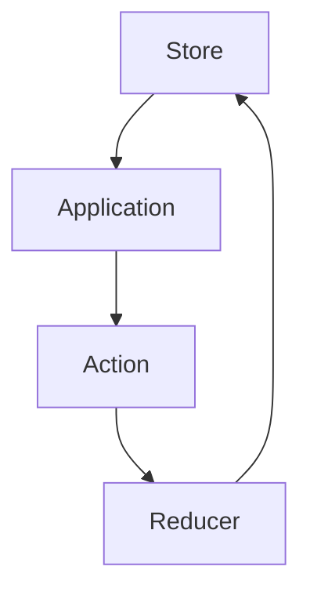

# Redux
Redux is state container for javascript applications.
    - helps manage global app state and share state amongst components
    - easier to see when, how, why state has changed in your application with the tools that it comes with
    - aids in writing predictable code 

# Redux toolkit
Tool for more efficient redux usage
    - helps configuring redux easier, less boilerplate and packages to install
    - an abstraction of redux

# React-Redux
The official Redux UI binding library for React
    - offers function to connect the two libraries to manage state

# When to use redux
- When you have large amounts of application state that are needed in many places in the app
- The app state is updated frequently over time
- Logic to update state is complicated
- Codebase is worked on by many developers

## Store
Entity which holds the global state

## Action
Describes what happened to the application

## Reducer
Describes how the store should be updated and updates it

